# Documentación Técnica — Perreo FC

---

## PORTADA

| | |
|---|---|
| **Título del proyecto** | Perreo FC — Aplicación Móvil de Gestión y Comunidad para Club de Fútbol |
| **Alumna** | Vera Martín |
| **Ciclo formativo** | Desarrollo de Aplicaciones Multiplataforma (DAM) |
| **Curso académico** | 2025–2026 |
| **Centro** | — |

---

## ABSTRACT

This document describes the full technical design and implementation of **Perreo FC**, a mobile application developed for a local football club. The app was built as the final project for the *Desarrollo de Aplicaciones Multiplataforma* (DAM) higher vocational training cycle.

The system covers the complete lifecycle of a club's digital ecosystem: from real-time sports data obtained by an automated web scraper, through a RESTful API that centralises all business logic, to a cross-platform mobile app consumed by fans, players and administrators. An AI-powered chatbot, built on top of an n8n automation workflow, answers natural-language questions about the club in real time.

The methodology followed an iterative approach: database design first, backend API second, scraper third, and frontend last. Each layer was containerised with Docker to ensure reproducibility. The result is a production-ready monorepo with five distinct services that communicate through a shared private network.

Key outcomes include: a fully functional React Native app supporting four user roles; an automated data pipeline that keeps standings, fixtures and player profiles in sync with the official federation website; a gamification system (points, bets, MVP votes, leaderboard); and a push-notification service that reaches all installed devices.

---

## ÍNDICE

1. [Justificación](#1-justificación)
2. [Introducción](#2-introducción)
3. [Objetivos](#3-objetivos)
4. [Desarrollo](#4-desarrollo)
   - 4.1 [Arquitectura General](#41-arquitectura-general)
   - 4.2 [Base de Datos](#42-base-de-datos)
   - 4.3 [Backend](#43-backend)
   - 4.4 [Frontend](#44-frontend)
   - 4.5 [Scraper](#45-scraper)
   - 4.6 [Workflows de n8n — Chatbot IA](#46-workflows-de-n8n--chatbot-ia)
   - 4.7 [Seguridad](#47-seguridad)
   - 4.8 [Despliegue y Configuración](#48-despliegue-y-configuración)
5. [Resultados](#5-resultados)
6. [Conclusiones](#6-conclusiones)
7. [Referencias Bibliográficas](#7-referencias-bibliográficas)
8. [Anexos](#8-anexos)
   - Anexo A: [Variables de entorno](#anexo-a-variables-de-entorno)
   - Anexo B: [Esquema completo de la base de datos](#anexo-b-esquema-completo-de-la-base-de-datos)
   - Anexo C: [Referencia completa de la API](#anexo-c-referencia-completa-de-la-api)
   - Anexo D: [Glosario](#anexo-d-glosario)

---

## 1. Justificación

Los clubes de fútbol aficionado en España —especialmente en categorías regionales y provinciales— carecen de herramientas digitales adaptadas a su realidad. Las soluciones existentes suelen ser costosas, genéricas o difíciles de mantener sin personal técnico especializado. Los socios y aficionados se informan por grupos de WhatsApp, hojas de cálculo compartidas y páginas web estáticas que nadie actualiza con regularidad.

Este proyecto nace de una necesidad real: ofrecer a un club de fútbol aficionado una plataforma digital propia, moderna y accesible, que centralice toda la información deportiva y fortalezca el vínculo entre el equipo y su comunidad.

La elección del tema se justifica por varias razones concretas:

**Relevancia técnica.** El proyecto integra tecnologías representativas del panorama actual del desarrollo de software: aplicaciones móviles multiplataforma (React Native + Expo), APIs REST tipadas (Fastify + TypeScript), bases de datos gestionadas en la nube (Supabase), automatización sin código (n8n), extracción de datos web (Playwright), e inteligencia artificial aplicada (chatbot con LLM). Ninguna tecnología es un fin en sí misma; todas responden a una necesidad funcional concreta.

**Cobertura curricular.** El proyecto pone en práctica los módulos más relevantes del ciclo DAM: Programación, Bases de Datos, Desarrollo de Interfaces, Sistemas Gestores de Bases de Datos, Acceso a Datos, y Programación Multimedia y Dispositivos Móviles.

**Impacto real.** A diferencia de proyectos académicos puramente teóricos, Perreo FC es una aplicación funcional que puede desplegarse y usarse por personas reales. Los datos deportivos proceden de la web oficial de la Real Federación de Fútbol de Madrid (RFFM) y son actualizados automáticamente.

**Complejidad adecuada.** El sistema está compuesto por cinco servicios independientes que colaboran entre sí. Diseñar, implementar e integrar esa arquitectura distribuida representa un reto técnico proporcional al nivel del ciclo formativo superior.

---

## 2. Introducción

**Perreo FC** es el nombre del club y también de la aplicación. El sistema permite a cuatro tipos de usuarios —aficionados, jugadores, administradores y superadministradores— interactuar con los datos del club de formas diferentes y con distintos niveles de privilegio.

Desde el punto de vista del aficionado, la app es una fuente centralizada de información: puede ver el calendario de partidos, la clasificación de la liga, los goleadores, las noticias y los álbumes de fotos. Además, puede participar activamente: apostar (con puntos ficticios) sobre resultados de partidos, votar al jugador más valioso (MVP) tras cada encuentro, y acumular puntos que determinan su posición en un ranking de aficionados llamado *Top Fans*.

Desde el punto de vista del jugador, la app ofrece todo lo anterior más acceso a información interna: convocatorias, eventos de entrenamiento, citas médicas y reuniones del club que no son visibles para los aficionados.

Desde el punto de vista del administrador o superadministrador, existe un panel de gestión completo: creación y edición de usuarios, configuración del sistema de puntos, envío de notificaciones push masivas, y un registro de auditoría que guarda cada acción administrativa.

El sistema obtiene sus datos deportivos —clasificaciones, resultados, fichas de jugadores, calendarios— de forma automática mediante un *scraper* que accede a la web de la federación. Esto elimina la necesidad de introducir datos manualmente y garantiza que la información está siempre actualizada.

El proyecto se organiza como un **monorepo** con cinco servicios:

| Servicio | Tecnología | Puerto |
|---|---|---|
| Backend API | Fastify + TypeScript | 3000 |
| Scraper | Playwright + Fastify | 3001 |
| Chat Bridge | Fastify | 3002 |
| Motor n8n | n8n | 5678 |
| Frontend | Expo React Native | 8081 / 19000 |

Todos los servicios se ejecutan en contenedores Docker y se comunican a través de una red privada gestionada por Docker Compose.

---

## 3. Objetivos

Los objetivos del proyecto, enunciados en infinitivo, son:

1. **Diseñar** una arquitectura de microservicios desacoplada que permita desarrollar, probar y desplegar cada componente de forma independiente.
2. **Implementar** una API REST robusta con autenticación basada en JWT, autorización por roles y protección contra abusos mediante *rate limiting*.
3. **Desarrollar** una aplicación móvil multiplataforma (iOS y Android) con navegación por pestañas, soporte de temas (claro/oscuro) e internacionalización en tres idiomas (español, catalán, inglés).
4. **Automatizar** la ingesta de datos deportivos mediante un *scraper* de bajo mantenimiento que sincroniza la base de datos con la web oficial de la federación.
5. **Integrar** un chatbot de inteligencia artificial que responda preguntas en lenguaje natural sobre el club usando los datos reales de la base de datos.
6. **Implementar** un sistema de gamificación (puntos, apuestas, votaciones, ranking) que fomente la participación y fidelización de los aficionados.
7. **Garantizar** la seguridad del sistema mediante cifrado de contraseñas, verificación de correo electrónico, límites de intentos, y auditoría de acciones administrativas.
8. **Documentar** el sistema de forma completa y profesional para facilitar su mantenimiento y extensión futura.

---

## 4. Desarrollo

### 4.1 Arquitectura General

#### 4.1.1 Visión global

Perreo FC sigue una arquitectura **cliente-servidor con capa de automatización**. El cliente es la aplicación móvil; el servidor central es la API REST; la capa de automatización está formada por el *scraper* y el motor n8n.

La base de datos es gestionada por **Supabase**, un servicio *Backend-as-a-Service* basado en PostgreSQL. Supabase proporciona autenticación, almacenamiento de ficheros y acceso directo a la base de datos. Sin embargo, en este proyecto el frontend nunca accede directamente a Supabase: toda comunicación pasa por la API REST propia, lo que centraliza la lógica de negocio y facilita el control de acceso.

#### 4.1.2 Diagrama de arquitectura general

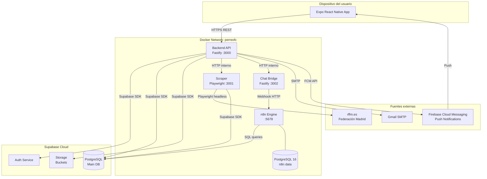

#### 4.1.3 Flujo de datos end-to-end

El siguiente diagrama muestra el recorrido completo de los datos, desde su origen en la web de la federación hasta que aparecen en la pantalla del usuario:

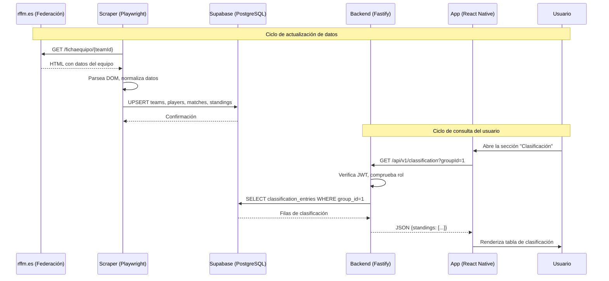

#### 4.1.4 Flujo de usuario — Autenticación y acceso

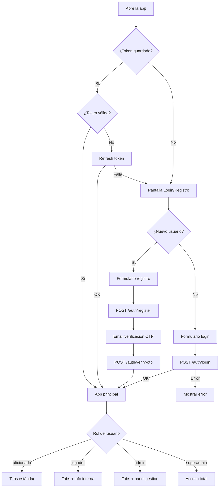

---

### 4.2 Base de Datos

#### 4.2.1 Tecnología y diseño

La base de datos principal es **PostgreSQL**, gestionada a través de **Supabase**. El esquema está versionado mediante migraciones SQL almacenadas en `perreofc-back/supabase/migrations/`. Supabase genera automáticamente un fichero TypeScript con todos los tipos de la base de datos (`src/shared/types/database.ts`, ~3.000 líneas), que el backend importa para obtener tipado estático completo.

El diseño sigue principios de normalización (3FN) con algunas desnormalizaciones deliberadas para mejorar el rendimiento en consultas frecuentes (por ejemplo, `points` en la tabla `users` es un campo calculado que se mantiene sincronizado mediante triggers/transacciones para evitar sumas costosas en tiempo real).

#### 4.2.2 Diagrama entidad-relación

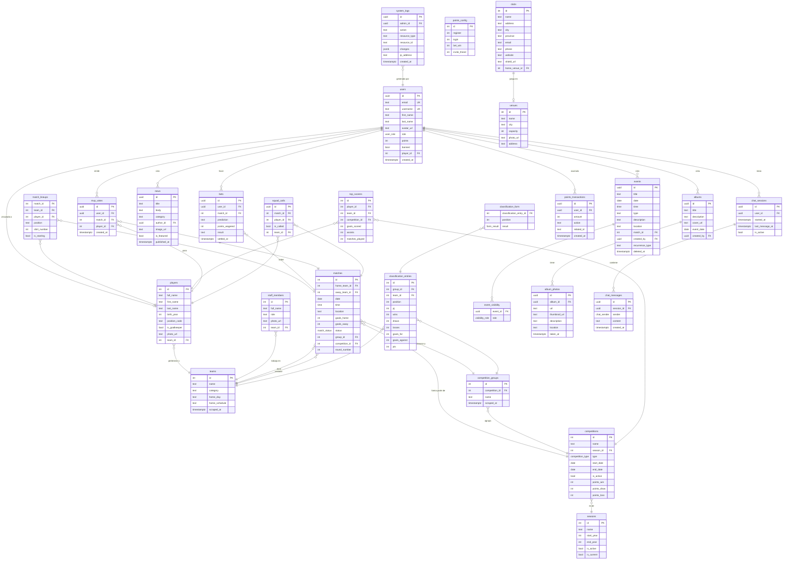

#### 4.2.3 Descripción detallada de tablas

---

##### `users`

Tabla central de usuarios. Se sincroniza con el sistema de autenticación de Supabase (tabla `auth.users`), que gestiona contraseñas y tokens. Esta tabla guarda el perfil público y los datos adicionales de aplicación.

| Columna | Tipo | Descripción |
|---|---|---|
| `id` | `uuid` | Clave primaria. Coincide con el `id` de `auth.users`. |
| `email` | `text` | Correo electrónico único. Índice único. |
| `username` | `text` | Nombre de usuario único, visible en el ranking. Índice único. |
| `first_name` | `text` | Nombre de pila. |
| `last_name` | `text` | Apellidos. |
| `avatar_url` | `text` | URL de la foto de perfil (bucket de Supabase Storage). |
| `role` | `user_role` | Enum: `aficionado`, `jugador`, `admin`, `superadmin`. Por defecto: `aficionado`. |
| `points` | `integer` | Puntos acumulados totales. Actualizado en cada transacción de puntos. |
| `banned` | `boolean` | Si es `true`, el usuario no puede iniciar sesión. Por defecto: `false`. |
| `player_id` | `integer` | FK opcional a `players.id`. Vincula la cuenta con un perfil de jugador. |
| `created_at` | `timestamptz` | Fecha de registro. |

**Restricciones:** `email` y `username` tienen restricciones `UNIQUE`. `role` tiene restricción `CHECK` contra el enum.

---

##### `players`

Perfiles de jugadores scrapeados desde la web de la federación. Un jugador puede existir en la base de datos sin tener un usuario asociado en la app.

| Columna | Tipo | Descripción |
|---|---|---|
| `id` | `integer` | ID de la federación. Clave primaria natural. |
| `full_name` | `text` | Nombre completo tal como aparece en la federación. |
| `first_name` | `text` | Nombre de pila (derivado del nombre completo). |
| `last_name` | `text` | Apellidos (derivados del nombre completo). |
| `birth_year` | `integer` | Año de nacimiento. |
| `position_code` | `text` | Código de posición (e.g., `PT`, `DF`, `MC`, `DL`). |
| `is_goalkeeper` | `boolean` | Verdadero si la posición es portero. |
| `photo_url` | `text` | URL de la foto oficial de la federación. |
| `team_id` | `integer` | FK a `teams.id`. Equipo actual. |

---

##### `teams`

Equipos de fútbol. El equipo propio (Perreo FC) tiene un ID configurado mediante la variable de entorno `OWN_TEAM_ID`.

| Columna | Tipo | Descripción |
|---|---|---|
| `id` | `integer` | ID de la federación. Clave primaria natural. |
| `name` | `text` | Nombre del equipo. |
| `category` | `text` | Categoría (e.g., "Primera Regional"). |
| `home_day` | `text` | Día habitual de partidos en casa (e.g., "Sábado"). |
| `home_schedule` | `text` | Hora habitual de partidos en casa. |
| `scraped_at` | `timestamptz` | Última vez que se actualizó desde la federación. |

---

##### `matches`

Partidos individuales. Un partido pertenece a un grupo de competición y a una competición general.

| Columna | Tipo | Descripción |
|---|---|---|
| `id` | `integer` | ID de la federación. |
| `home_team_id` | `integer` | FK a `teams.id`. Equipo local. |
| `away_team_id` | `integer` | FK a `teams.id`. Equipo visitante. |
| `date` | `date` | Fecha del partido. |
| `time` | `time` | Hora de inicio. |
| `location` | `text` | Nombre del estadio o campo. |
| `goals_home` | `integer` | Goles del equipo local. `NULL` si no ha terminado. |
| `goals_away` | `integer` | Goles del equipo visitante. `NULL` si no ha terminado. |
| `status` | `match_status` | Enum: `upcoming`, `live`, `finished`. |
| `group_id` | `integer` | FK a `competition_groups.id`. |
| `competition_id` | `integer` | FK a `competitions.id`. |
| `round_number` | `integer` | Número de jornada. |
| `match_minute` | `integer` | Minuto de juego (si `status = live`). |
| `spectators` | `integer` | Aforo registrado. |
| `referee` | `text` | Nombre del árbitro. |

---

##### `bets`

Apuestas de aficionados sobre resultados de partidos. El sistema no implica dinero real.

| Columna | Tipo | Descripción |
|---|---|---|
| `id` | `uuid` | Clave primaria generada. |
| `user_id` | `uuid` | FK a `users.id`. |
| `match_id` | `integer` | FK a `matches.id`. |
| `prediction` | `text` | Uno de: `home_win`, `draw`, `away_win`. |
| `points_wagered` | `integer` | Puntos apostados (actualmente constante, configurable). |
| `result` | `text` | Uno de: `won`, `lost`, `pending`. Por defecto: `pending`. |
| `settled_at` | `timestamptz` | Cuándo se resolvió la apuesta. `NULL` si pendiente. |
| `created_at` | `timestamptz` | Cuándo se hizo la apuesta. |

**Restricción:** Un usuario no puede hacer más de una apuesta por partido. Se garantiza mediante una restricción `UNIQUE (user_id, match_id)`.

---

##### `points_transactions`

Registro contable de todos los movimientos de puntos. Esta tabla es la fuente de verdad; el campo `users.points` es un resumen que se mantiene actualizado.

| Columna | Tipo | Descripción |
|---|---|---|
| `id` | `uuid` | Clave primaria. |
| `user_id` | `uuid` | FK a `users.id`. |
| `amount` | `integer` | Cantidad de puntos (positivo = ganancia, negativo = deducción). |
| `action` | `text` | Uno de: `register`, `login`, `bet_win`, `invite`, `custom`. |
| `related_id` | `text` | ID opcional del recurso relacionado (e.g., ID del partido apostado). |
| `created_at` | `timestamptz` | Marca de tiempo de la transacción. |

---

##### `events` y `event_visibility`

La tabla `events` almacena todos los eventos del calendario del club. La tabla `event_visibility` controla qué roles pueden ver cada evento, implementando así el control de acceso a nivel de fila.

| Columna (`events`) | Tipo | Descripción |
|---|---|---|
| `id` | `uuid` | Clave primaria. |
| `title` | `text` | Título del evento. |
| `date` | `date` | Fecha. |
| `time` | `time` | Hora. |
| `type` | `text` | Uno de: `partido`, `amistoso`, `entrenamiento`, `cita_medica`, `reunion`, `cena`, `otro`. |
| `description` | `text` | Descripción libre. |
| `location` | `text` | Lugar del evento. |
| `match_id` | `integer` | FK opcional a `matches.id` (si el evento es un partido). |
| `created_by` | `uuid` | FK a `users.id`. |
| `recurrence_type` | `text` | Uno de: `none`, `weekly`, `biweekly`, `monthly`. |
| `recurrence_interval` | `integer` | Número de períodos entre repeticiones. |
| `recurrence_end_date` | `date` | Fecha final de recurrencia. |
| `deleted_at` | `timestamptz` | Borrado lógico (soft delete). |

| Columna (`event_visibility`) | Tipo | Descripción |
|---|---|---|
| `event_id` | `uuid` | FK a `events.id`. |
| `role` | `visibility_role` | Enum: `aficionado`, `jugador`, `admin`, `superadmin`. |

Un evento puede tener múltiples filas en `event_visibility` si es visible por varios roles. Al consultar, el backend filtra por el rol del usuario autenticado.

---

##### `system_logs`

Registro de auditoría de acciones administrativas. Inmutable: los logs no se pueden borrar desde la aplicación.

| Columna | Tipo | Descripción |
|---|---|---|
| `id` | `uuid` | Clave primaria. |
| `admin_id` | `uuid` | FK a `users.id`. Quién realizó la acción. |
| `action` | `text` | Descripción de la acción (e.g., `ban_user`, `update_points`). |
| `resource_type` | `text` | Tipo de recurso afectado (e.g., `user`, `match`). |
| `resource_id` | `text` | ID del recurso afectado. |
| `changes` | `jsonb` | Snapshot de los cambios realizados (antes/después). |
| `ip_address` | `text` | IP del administrador en el momento de la acción. |
| `created_at` | `timestamptz` | Marca de tiempo de la acción. |

#### 4.2.4 Enumeraciones (tipos ENUM)

PostgreSQL permite definir tipos de datos personalizados. Perreo FC usa los siguientes enums:

| Enum | Valores |
|---|---|
| `user_role` | `aficionado`, `jugador`, `admin`, `superadmin` |
| `visibility_role` | `aficionado`, `jugador`, `admin`, `superadmin` |
| `match_status` | `upcoming`, `live`, `finished` |
| `form_result` | `win`, `draw`, `loss` |
| `chat_sender` | `user`, `bot` |
| `competition_type` | `league`, `cup`, `friendly` |

El uso de enums en lugar de texto libre garantiza la integridad referencial de los datos y facilita la generación de tipos TypeScript exactos.

#### 4.2.5 Índices y restricciones notables

- `users.email`: `UNIQUE INDEX` — evita duplicados de cuenta.
- `users.username`: `UNIQUE INDEX` — evita conflictos en el ranking.
- `bets (user_id, match_id)`: `UNIQUE INDEX` — una apuesta por partido por usuario.
- `mvp_votes (user_id, match_id)`: `UNIQUE INDEX` — un voto por partido por usuario.
- `classification_entries (group_id, team_id)`: `UNIQUE INDEX` — una fila por equipo en cada grupo.
- `top_scorers (player_id, competition_id)`: `UNIQUE INDEX` — un registro por jugador por competición.
- `system_logs`: sin índice de borrado — los logs son inmutables por diseño.

---

### 4.3 Backend

#### 4.3.1 Tecnología y estructura del proyecto

El backend es una API REST implementada con **Fastify 5** y **TypeScript**. Fastify fue elegido por su rendimiento (es significativamente más rápido que Express en benchmarks estándar) y su sistema de plugins tipado.

```
perreofc-back/
├── src/
│   ├── api/
│   │   ├── features/           # Módulos por funcionalidad
│   │   │   ├── auth/
│   │   │   │   ├── authController.ts
│   │   │   │   ├── authRoutes.ts
│   │   │   │   ├── authServices.ts
│   │   │   │   ├── authSchema.ts
│   │   │   │   └── authTypes.ts
│   │   │   ├── albums/
│   │   │   ├── bets/
│   │   │   ├── chat/
│   │   │   ├── classification/
│   │   │   ├── competitions/
│   │   │   ├── events/
│   │   │   ├── home/
│   │   │   ├── leaderboard/
│   │   │   ├── logs/
│   │   │   ├── matches/
│   │   │   ├── mvpVotes/
│   │   │   ├── news/
│   │   │   ├── notifications/
│   │   │   ├── players/
│   │   │   ├── points/
│   │   │   ├── seasons/
│   │   │   ├── squadCalls/
│   │   │   ├── teams/
│   │   │   ├── topScorers/
│   │   │   ├── upload/
│   │   │   └── users/
│   │   └── index.ts            # Registro de todas las rutas
│   ├── shared/
│   │   ├── env.ts              # Validación de variables de entorno (Zod)
│   │   ├── supabase.ts         # Clientes Supabase (anon + service)
│   │   ├── mailer.ts           # Servicio de correo (Nodemailer/Gmail)
│   │   ├── validators.ts       # Validación de contraseñas
│   │   └── types/
│   │       └── database.ts     # Tipos generados por Supabase (~3.000 líneas)
│   └── server.ts               # Punto de entrada, configuración de Fastify
├── supabase/
│   └── migrations/             # Ficheros SQL de migraciones
├── Dockerfile.dev
└── package.json
```

#### 4.3.2 Patrón de módulo (Feature Module)

Cada funcionalidad sigue el mismo patrón de cuatro capas:

```
Routes → Controller → Services → Supabase SDK
```

- **Routes** (`*Routes.ts`): Define las rutas Fastify, asocia *prehandlers* de autenticación/autorización y valida el *body* de las peticiones con esquemas Zod/JSON Schema.
- **Controller** (`*Controller.ts`): Extrae los parámetros de la petición HTTP, llama a los servicios y transforma la respuesta al formato de salida.
- **Services** (`*Services.ts`): Contiene la lógica de negocio. Accede a la base de datos mediante el cliente Supabase. No conoce nada de HTTP.
- **Schema** (`*Schema.ts`): Esquemas Zod para validación de entrada y tipos de salida.

Este patrón garantiza que la lógica de negocio es independiente del framework HTTP, lo que facilita las pruebas unitarias.

#### 4.3.3 Servidor Fastify (`server.ts`)

```typescript
// Configuración de plugins globales
fastify.register(cors, { origin: env.FRONTEND_URL || true })
fastify.register(helmet, { contentSecurityPolicy: false })
fastify.register(rateLimit, { max: 200, timeWindow: '1 minute' })
fastify.register(multipart)

// Prefijo global de todas las rutas
fastify.register(apiRoutes, { prefix: '/api/v1' })
```

El servidor escucha en el puerto definido por la variable de entorno `API_PORT` (por defecto 3000) y en todas las interfaces de red (`0.0.0.0`), lo que permite el acceso desde el contenedor Docker y desde la red local.

#### 4.3.4 Autenticación y middleware

La autenticación se basa en **JWT (JSON Web Tokens)** generados por Supabase. El flujo es el siguiente:

1. El usuario envía sus credenciales a `POST /auth/login`.
2. El backend llama a `supabase.auth.signInWithPassword()`.
3. Supabase verifica las credenciales y devuelve un `access_token` (JWT) y un `refresh_token`.
4. El backend retorna ambos tokens al cliente.
5. En cada petición protegida, el cliente incluye el `access_token` en el header `Authorization: Bearer <token>`.
6. El middleware `requireAuth` verifica el token con `supabase.auth.getUser(token)`.
7. Si el token es válido, el ID del usuario se inyecta en el contexto de la petición.

El middleware `requireAuth` se implementa como un *preHandler* de Fastify:

```typescript
async function requireAuth(request: FastifyRequest, reply: FastifyReply) {
  const token = request.headers.authorization?.replace('Bearer ', '')
  if (!token) return reply.code(401).send({ error: 'No autorizado' })

  const { data, error } = await supabase.auth.getUser(token)
  if (error || !data.user) return reply.code(401).send({ error: 'Token inválido' })

  request.user = data.user
}
```

Para las rutas que requieren un rol específico existe un middleware adicional `requireRole(role)`:

```typescript
function requireRole(minRole: UserRole) {
  return async (request: FastifyRequest, reply: FastifyReply) => {
    const userRole = request.user?.role
    if (!hasPermission(userRole, minRole)) {
      return reply.code(403).send({ error: 'Sin permisos suficientes' })
    }
  }
}
```

El orden de privilegios es: `aficionado < jugador < admin < superadmin`.

#### 4.3.5 Módulo de autenticación — Lógica de negocio completa

El módulo `auth` es el más complejo del backend. Sus principales flujos son:

**Registro (`POST /auth/register`)**

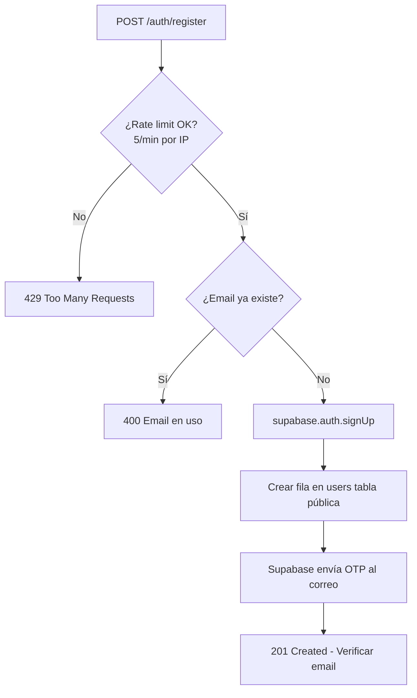

**Verificación OTP (`POST /auth/verify-otp`)**

El usuario recibe un código de 6 dígitos por correo. Lo introduce en la app. El backend llama a `supabase.auth.verifyOtp({ email, token, type: 'signup' })`. Si es correcto, Supabase marca la cuenta como verificada y devuelve la sesión completa.

**Recuperación de contraseña (`POST /auth/forgot-password`)**

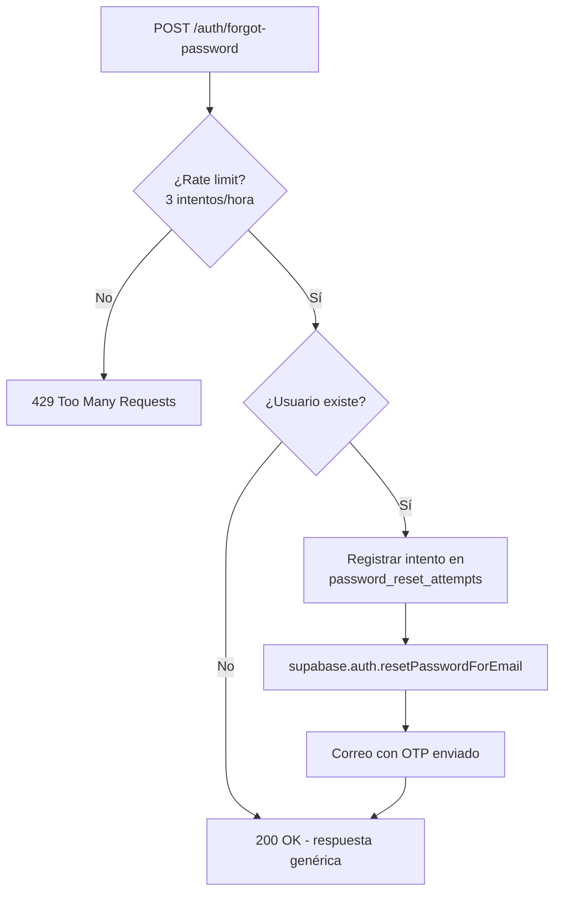

La respuesta es siempre `200 OK` aunque el correo no exista, para evitar la enumeración de usuarios.

**Cambio de contraseña (`POST /auth/change-password`)**

- Requiere autenticación (`requireAuth`).
- Verifica la contraseña actual antes de cambiar.
- Límite de 3 cambios exitosos en 24 horas (tabla `password_change_attempts`).
- Valida que la nueva contraseña cumpla los requisitos de seguridad.

#### 4.3.6 Módulo de apuestas — Lógica de negocio

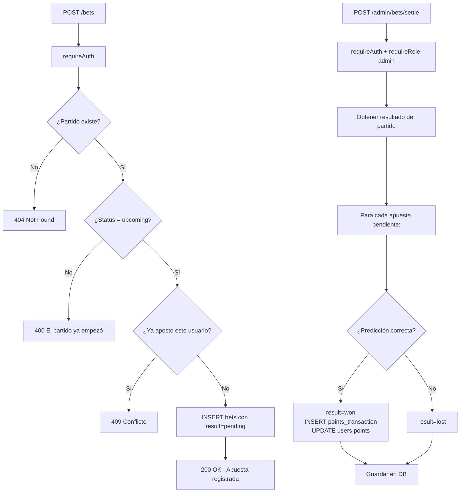

#### 4.3.7 Módulo de leaderboard — Consulta del ranking

El ranking de aficionados soporta tres períodos temporales: `total`, `monthly` y `weekly`. La consulta varía según el período:

- **Total**: `SUM(amount)` de toda la tabla `points_transactions` por usuario. Equivalente al campo `users.points`.
- **Monthly**: `SUM(amount)` filtrado por `created_at >= inicio_del_mes`.
- **Weekly**: `SUM(amount)` filtrado por `created_at >= inicio_de_la_semana`.

La paginación devuelve también la posición del usuario autenticado, aunque no esté en la página actual.

#### 4.3.8 Módulo de notificaciones

El backend envía notificaciones push mediante **Firebase Cloud Messaging (FCM)**. Los tokens de dispositivo se registran en la tabla `users` cuando el usuario concede permisos en la app. El endpoint de envío permite segmentar por rol (`all`, `aficionados`, `jugadores`, `admins`).

#### 4.3.9 Módulo de eventos del calendario

Los eventos implementan **borrado lógico** (soft delete): en lugar de eliminar la fila, se actualiza `deleted_at` con la marca de tiempo actual. Todas las consultas filtran automáticamente los eventos con `deleted_at IS NOT NULL`.

Los eventos **recurrentes** se generan en el backend cuando se crea el evento padre. Por ejemplo, un entrenamiento semanal genera múltiples filas en la tabla `events`, una por cada semana hasta `recurrence_end_date`. Este enfoque (materialización de recurrencias) simplifica las consultas de calendario a expensas de más espacio en disco.

#### 4.3.10 Servicio de correo electrónico

El backend usa **Nodemailer** con una cuenta de Gmail. Las credenciales (`GMAIL_USER`, `GMAIL_APP_PASSWORD`) se validan al arrancar mediante Zod. El servicio se usa únicamente para correos de sistema (confirmación de cuenta, recuperación de contraseña) que no gestiona directamente Supabase.

#### 4.3.11 Validación de datos de entrada

Todas las rutas con cuerpo de petición usan **esquemas JSON Schema** definidos con Zod y compilados para Fastify. Fastify rechaza automáticamente las peticiones con cuerpos inválidos con `400 Bad Request` y un mensaje descriptivo.

Ejemplo del esquema de registro:

```typescript
const registerSchema = z.object({
  email: z.string().email('Correo inválido'),
  password: z.string().min(8, 'Mínimo 8 caracteres'),
  username: z.string().min(3).max(30).regex(/^[a-zA-Z0-9_]+$/),
  first_name: z.string().min(1).max(100),
  last_name: z.string().min(1).max(100),
})
```

---

### 4.4 Frontend

#### 4.4.1 Tecnología y decisiones de diseño

El frontend es una aplicación **React Native** construida con **Expo SDK 54**. Se eligió Expo por su ecosistema maduro, soporte para iOS y Android desde un único código base, y la herramienta de *over-the-air updates* para futuras actualizaciones sin pasar por las tiendas de aplicaciones.

El enrutamiento usa **Expo Router 6**, que implementa un sistema de rutas basado en el sistema de ficheros (similar a Next.js), con soporte para grupos de rutas, rutas dinámicas y layouts anidados.

El estilo visual usa **NativeWind 4**, que lleva Tailwind CSS al mundo de React Native, permitiendo clases de utilidad directamente en los componentes.

**Internacionalización:** La app soporta español (es), catalán (ca) e inglés (en) mediante la librería `i18n-js`. El idioma se detecta automáticamente a partir de la configuración del dispositivo y puede cambiarse desde los ajustes del perfil.

#### 4.4.2 Estructura del proyecto

```
perreofc-front/
├── app/
│   ├── _layout.tsx              # Layout raíz (providers globales)
│   ├── (auth)/
│   │   ├── _layout.tsx          # Layout del stack de auth
│   │   ├── login.tsx
│   │   ├── register.tsx
│   │   ├── forgot-password.tsx
│   │   ├── verify-email.tsx
│   │   └── reset-password.tsx
│   └── (app)/
│       ├── _layout.tsx          # Layout principal (tabs)
│       ├── (tabs)/
│       │   ├── _layout.tsx      # Definición de pestañas
│       │   ├── calendario/
│       │   │   ├── index.tsx    # Vista mensual del calendario
│       │   │   ├── nueva.tsx    # Crear evento
│       │   │   ├── evento/
│       │   │   │   └── [id].tsx # Detalle de evento
│       │   │   └── partido/
│       │   │       └── [id].tsx # Detalle de partido
│       │   ├── noticias/
│       │   │   ├── index.tsx    # Lista de noticias
│       │   │   ├── [id].tsx     # Artículo completo
│       │   │   ├── nueva.tsx    # Crear noticia
│       │   │   └── editar/
│       │   │       └── [id].tsx # Editar noticia
│       │   ├── equipo/
│       │   │   ├── index.tsx    # Ficha del equipo
│       │   │   └── [equipoId]/
│       │   │       ├── jugador/
│       │   │       │   └── [id].tsx  # Perfil de jugador
│       │   │       └── gallery.tsx
│       │   └── chatbot.tsx      # Chat con IA
│       ├── gestion/             # Panel admin
│       │   ├── index.tsx
│       │   ├── usuarios/
│       │   │   ├── index.tsx
│       │   │   └── [id].tsx
│       │   ├── puntos.tsx
│       │   ├── leaderboard.tsx
│       │   ├── notificaciones.tsx
│       │   └── logs.tsx
│       └── profile/
│           └── index.tsx        # Perfil del usuario
├── src/
│   ├── services/
│   │   ├── api/
│   │   │   ├── apiClient.ts     # Wrapper de fetch con auth
│   │   │   ├── index.ts         # Exporta todos los módulos
│   │   │   └── modules/         # Un fichero por recurso de API
│   │   └── auth.ts              # Gestión de sesión (tokens)
│   ├── store/
│   │   ├── useAuthStore.ts      # Estado global de autenticación
│   │   ├── useEventsStore.ts    # Cache de eventos del calendario
│   │   ├── useNotificationsStore.ts
│   │   └── useThemeStore.ts     # Preferencia de tema (claro/oscuro)
│   ├── hooks/                   # Custom hooks reutilizables
│   ├── components/              # Componentes UI reutilizables
│   ├── theme/                   # Sistema de diseño (colores, tipografía)
│   ├── types/                   # Tipos TypeScript de dominio
│   ├── i18n/
│   │   ├── index.ts             # Configuración de i18n-js
│   │   └── locales/
│   │       ├── es.json
│   │       ├── ca.json
│   │       └── en.json
│   └── utils/                   # Utilidades (haptics, fechas, etc.)
├── Dockerfile.dev
└── package.json
```

#### 4.4.3 Sistema de navegación

Expo Router usa el sistema de ficheros para definir las rutas. Los grupos entre paréntesis (e.g., `(auth)`, `(app)`) son grupos de layout que no aparecen en la URL.

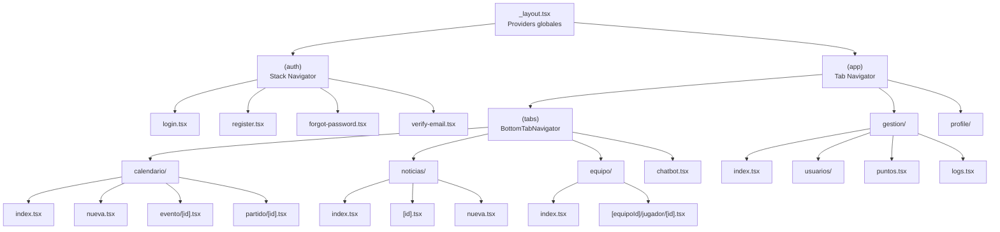

#### 4.4.4 Estado global — Zustand

Zustand es una librería de gestión de estado minimalista para React. Perreo FC usa cuatro *stores*:

**`useAuthStore`** — Estado de autenticación

```typescript
interface AuthStore {
  user: User | null
  session: Session | null
  isLoading: boolean
  login: (email: string, password: string) => Promise<void>
  logout: () => Promise<void>
  refreshSession: () => Promise<void>
}
```

El store persiste el token en `expo-secure-store` (almacenamiento cifrado del dispositivo) mediante el middleware `persist` de Zustand.

**`useThemeStore`** — Preferencia de tema

```typescript
interface ThemeStore {
  theme: 'light' | 'dark' | 'system'
  setTheme: (theme: Theme) => void
}
```

**`useEventsStore`** — Cache de eventos del calendario

Evita refetchs innecesarios al navegar entre meses del calendario.

**`useNotificationsStore`** — Token FCM y preferencias de notificaciones

#### 4.4.5 Cliente API (`apiClient.ts`)

El cliente API es un wrapper sobre el `fetch` nativo de JavaScript que inyecta automáticamente el token de autenticación en las cabeceras y gestiona los errores de red de forma uniforme:

```typescript
async function apiRequest<T>(
  endpoint: string,
  options: RequestInit = {}
): Promise<T> {
  const token = await getStoredToken()
  const response = await fetch(`${API_BASE_URL}${endpoint}`, {
    ...options,
    headers: {
      'Content-Type': 'application/json',
      ...(token ? { Authorization: `Bearer ${token}` } : {}),
      ...options.headers,
    },
  })

  if (response.status === 401) {
    // Token expirado — intentar refresh
    await refreshToken()
    // Reintentar la petición original
  }

  if (!response.ok) {
    const error = await response.json()
    throw new ApiError(response.status, error.message)
  }

  return response.json()
}
```

#### 4.4.6 Módulos de API (15+ módulos)

Cada recurso tiene su propio fichero en `src/services/api/modules/`, que exporta funciones tipadas:

```typescript
// modules/teams.ts
export const teams = {
  getTeam: (teamId: number) =>
    apiRequest<Team>(`/teams/${teamId}`),

  getSquad: (teamId: number) =>
    apiRequest<Squad>(`/teams/${teamId}/squad`),

  getMatches: (teamId: number, options?: PaginationOptions) =>
    apiRequest<PaginatedResponse<Match>>(`/teams/${teamId}/matches`, {
      params: options
    }),
}
```

Todos los módulos se exportan desde `src/services/api/index.ts` como un objeto unificado `api`, lo que permite usar `api.teams.getSquad(id)` desde cualquier componente.

#### 4.4.7 Pantallas principales

**Pantalla de Login (`login.tsx`)**

- Formulario con React Hook Form + Zod validation.
- Campos: correo electrónico, contraseña.
- Botón "¿Olvidaste tu contraseña?" navega a `forgot-password.tsx`.
- Muestra spinner durante la petición.
- Error visible bajo el campo correspondiente si la validación falla.

**Pantalla de Calendario (`calendario/index.tsx`)**

- Grid mensual con días marcados si tienen eventos.
- Selector de mes con flechas de navegación.
- Al pulsar un día, se muestra una lista de eventos de ese día en la parte inferior.
- Los eventos de tipo `entrenamiento`, `cita_medica` y `reunion` solo son visibles para jugadores y administradores.
- Filtrado en cliente tras recibir todos los eventos del mes.

**Pantalla de Clasificación**

- Tabla scrollable con todos los equipos del grupo.
- Columnas: posición, nombre, PJ, G, E, P, GF, GC, DG, Pts.
- Fila del equipo propio resaltada con color diferente.
- Selector de competición si hay varias activas.

**Pantalla de Top Fans**

- Podio animado con los tres primeros aficionados.
- Lista completa con posición, avatar, nombre y puntos.
- Fila del usuario autenticado siempre visible y resaltada.
- Selector de período: Total / Mensual / Semanal.

**Pantalla del Chatbot (`chatbot.tsx`)**

- Interfaz de chat tipo burbuja (mensajes del usuario a la derecha, del bot a la izquierda).
- Indicador de escritura animado mientras el bot procesa.
- Historial de la sesión actual guardado en el estado local.
- Timeout de 120 segundos para respuestas del modelo (el modelo Ollama puede ser lento).

**Panel de Gestión (`gestion/index.tsx`)** — Solo admins

- Accesible únicamente para usuarios con rol `admin` o `superadmin`.
- Cards de acceso rápido a: Usuarios, Sistema de Puntos, Top Fans, Notificaciones Push, Logs.
- Guard de acceso implementado en el layout de `gestion/`: redirige a la pantalla principal si el rol no es suficiente.

---

### 4.5 Scraper

#### 4.5.1 Propósito y contexto

La Real Federación de Fútbol de Madrid (RFFM) publica en su web oficial (`rffm.es`) los datos de todos los equipos de su competición: plantillas, resultados, clasificaciones, calendarios y goleadores. Sin embargo, no ofrece ninguna API pública para acceder a estos datos de forma programática.

El scraper de Perreo FC resuelve este problema automatizando la navegación y extracción de datos de la web federativa. Usa **Playwright**, un framework de automatización de navegadores desarrollado por Microsoft, que permite controlar un navegador Chromium de forma programática sin interfaz gráfica (modo *headless*).

#### 4.5.2 Arquitectura del scraper

```
TFG-PERREOFC-SCRAPEO/
├── src/
│   ├── server.scrapers.ts       # Servidor Fastify (puerto 3001)
│   ├── api/
│   │   └── routes/
│   │       ├── public.ts        # Endpoints de estado de jobs
│   │       └── internal.ts      # Endpoints de disparo de scrapers
│   ├── scrapers/                # Un fichero por tipo de dato
│   │   ├── team.ts
│   │   ├── player.ts
│   │   ├── match.ts
│   │   ├── standings.ts
│   │   ├── topScorers.ts
│   │   ├── competitions.ts
│   │   └── calendar.ts
│   ├── persist/                 # Operaciones de upsert en Supabase
│   │   ├── upsertTeam.ts
│   │   ├── upsertMatch.ts
│   │   ├── upsertMatches.ts
│   │   ├── upsertStandings.ts
│   │   ├── upsertTopScorers.ts
│   │   ├── upsertPlayer.ts
│   │   ├── upsertCompetitions.ts
│   │   └── upsertCalendar.ts
│   ├── services/
│   │   └── jobStore.ts          # Seguimiento de jobs en memoria
│   └── shared/
│       ├── types.ts             # Tipos TypeScript del scraper
│       └── utils.ts             # Funciones auxiliares (normalización)
├── Dockerfile.dev
└── package.json
```

#### 4.5.3 Flujo de un job de scraping

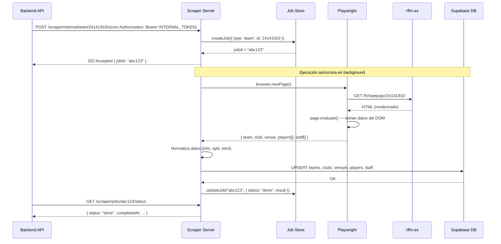

#### 4.5.4 Scrapers individuales

**Scraper de equipo (`scrapers/team.ts`)**

- URL: `https://www.rffm.es/fichaequipo/{teamId}`
- Datos extraídos:
  - Del panel del equipo: nombre, categoría, día y horario de partidos en casa.
  - Del panel del club: nombre, dirección, ciudad, provincia, código postal, email, teléfono, web, escudo.
  - Del panel del estadio: nombre, ciudad, aforo, foto, dirección.
  - De la tabla de jugadores: ID, nombre completo, año de nacimiento, posición, foto.
  - De la tabla de técnicos: nombre, rol (entrenador, auxiliar, delegado...), foto.

**Scraper de clasificación (`scrapers/standings.ts`)**

- URL: Página de clasificación del grupo de la competición.
- Datos extraídos:
  - Para cada equipo: posición, partidos jugados, victorias/empates/derrotas (total y casa/fuera), goles a favor/en contra, diferencia de goles, puntos.
  - Penalizaciones de puntos si las hay.
  - Forma reciente: últimos 5 resultados (W/D/L).

**Scraper de calendario (`scrapers/calendar.ts`)**

- URL: Página de jornadas de la competición.
- Datos extraídos:
  - Para cada partido: equipos local y visitante, fecha, hora, estadio, resultado (si terminó), ID del partido.

**Scraper de goleadores (`scrapers/topScorers.ts`)**

- URL: Tabla de clasificación de goleadores.
- Datos extraídos: jugador, equipo, goles marcados (total y de penalti), asistencias, partidos jugados.

**Scraper de partido (`scrapers/match.ts`)**

- URL: Ficha individual de partido.
- Datos extraídos: alineaciones (once inicial y suplentes), posiciones, dorsales, goleadores con minuto.

#### 4.5.5 Normalización de datos

La web de la federación no siempre sigue un formato consistente. El scraper aplica varias transformaciones:

```typescript
// Funciones de normalización (shared/utils.ts)

function normalizeText(text: string): string {
  return text.trim().replace(/\s+/g, ' ')
}

function parseYear(text: string): number | null {
  const match = text.match(/\b(19|20)\d{2}\b/)
  return match ? parseInt(match[0]) : null
}

function splitFullName(fullName: string): { firstName: string; lastName: string } {
  // Los nombres en la federación suelen ser: APELLIDO1 APELLIDO2, Nombre
  const parts = fullName.split(',')
  if (parts.length === 2) {
    return { firstName: parts[1].trim(), lastName: parts[0].trim() }
  }
  // Fallback: primera palabra = nombre, resto = apellidos
  const words = fullName.split(' ')
  return { firstName: words[0], lastName: words.slice(1).join(' ') }
}

function parseInt(text: string): number {
  const num = parseInt(text.replace(/[^0-9]/g, ''))
  return isNaN(num) ? 0 : num
}
```

#### 4.5.6 Capa de persistencia (Upsert)

Cada módulo de persistencia usa la operación `upsert` de Supabase, que inserta si el registro no existe o actualiza si ya existe (basándose en la clave primaria o en columnas únicas):

```typescript
// persist/upsertTeam.ts
async function upsertTeam(teamData: ScrapedTeam) {
  const { error } = await supabase
    .from('teams')
    .upsert(
      {
        id: teamData.id,
        name: teamData.name,
        category: teamData.category,
        scraped_at: new Date().toISOString(),
      },
      { onConflict: 'id' }
    )

  if (error) throw new Error(`Error al guardar equipo: ${error.message}`)
}
```

#### 4.5.7 Sistema de jobs

El servidor scraper gestiona las ejecuciones como **jobs asíncronos**. Cuando la API dispara un scraping, el servidor responde inmediatamente con un `jobId` (202 Accepted) sin bloquear la petición. El scraping se ejecuta en segundo plano. El estado del job se consulta mediante `GET /scraper/jobs/:jobId/status`.

El `jobStore` es un `Map` en memoria que almacena:

```typescript
interface Job {
  id: string
  type: string
  status: 'pending' | 'running' | 'done' | 'error'
  startedAt: Date
  completedAt?: Date
  result?: unknown
  error?: string
}
```

En producción, este almacén en memoria debería reemplazarse por una cola persistente (e.g., Redis + Bull) para sobrevivir reinicios del contenedor.

#### 4.5.8 Seguridad del scraper

Los endpoints internos del scraper (`/scraper/internal/*`) están protegidos mediante un token secreto compartido (`INTERNAL_TOKEN`). Este token se configura como variable de entorno y es conocido únicamente por el backend. El scraper valida el token en cada petición antes de ejecutar cualquier operación.

---

### 4.6 Workflows de n8n — Chatbot IA

#### 4.6.1 Arquitectura del chatbot

El chatbot de Perreo FC permite a los usuarios hacer preguntas en lenguaje natural sobre el club. La arquitectura se basa en **n8n**, una plataforma de automatización de flujos de trabajo de código abierto que soporta integración con modelos de lenguaje (LLMs).

```mermaid
flowchart LR
    APP[App móvil\nChatbot screen] -->|POST /chat\nmessage: texto| BRIDGE[Chat Bridge\nFastify :3002]
    BRIDGE -->|POST /webhook/perreito-chatbot\n{message, sessionId}| N8N[n8n Engine\n:5678]
    N8N -->|1. Analizar pregunta| LLM[LLM\nOllama / Claude]
    N8N -->|2. Consultar datos| DB[(Supabase\nPostgreSQL)]
    DB -->|Resultados de la consulta| N8N
    N8N -->|3. Generar respuesta con contexto| LLM
    LLM -->|Texto de respuesta| N8N
    N8N -->|Respuesta final| BRIDGE
    BRIDGE -->|{answer: texto}| APP
```

#### 4.6.2 Chat Bridge — Servidor Fastify (`fastify-chat-server.ts`)

El Chat Bridge actúa como intermediario entre la app móvil y el motor n8n. Su función principal es:

1. **Recibir** mensajes de la app con validación de formato.
2. **Retransmitir** los mensajes al webhook de n8n.
3. **Manejar** timeouts (120 segundos) y errores de conexión.
4. **Devolver** la respuesta del modelo al cliente.

Endpoints del Chat Bridge:

| Método | Ruta | Descripción |
|---|---|---|
| `GET` | `/health` | Estado del servidor y del webhook de n8n |
| `POST` | `/chat` | Enviar mensaje (tabla por defecto: `teams`) |
| `POST` | `/chat/:table` | Enviar mensaje especificando la tabla a consultar |
| `GET` | `/chat/available-tables` | Lista de tablas que el chatbot puede consultar |

Tablas consultables:

```
teams, clubs, players, matches, competitions,
classification_entries, top_scorers
```

Validación del mensaje:

```typescript
if (!body.message || body.message.trim().length === 0) {
  return reply.code(400).send({ error: 'El mensaje no puede estar vacío' })
}
if (body.message.length > 1000) {
  return reply.code(400).send({ error: 'El mensaje es demasiado largo (máximo 1000 caracteres)' })
}
```

#### 4.6.3 Workflow de n8n — Descripción completa

El workflow principal de n8n se activa mediante un **webhook HTTP** y sigue los siguientes pasos:

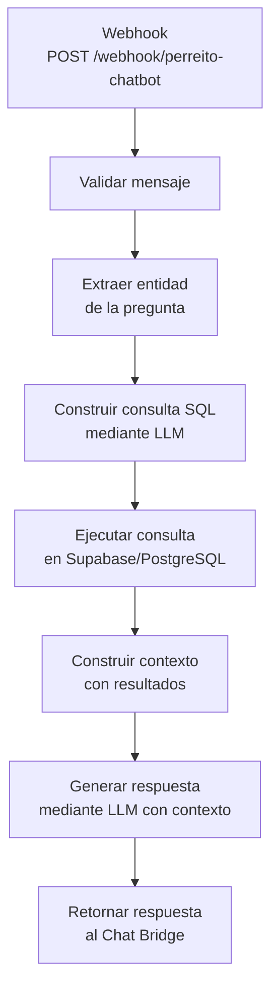

**Nodo 1 — Webhook Trigger**

- Método: `POST`
- Path: `/webhook/perreito-chatbot`
- Acepta: `{ message: string, sessionId?: string, table?: string }`
- No requiere autenticación HTTP (la seguridad la gestiona el Chat Bridge)

**Nodo 2 — Análisis de intención**

El LLM recibe el mensaje del usuario y determina:
- ¿Sobre qué tabla de datos trata la pregunta?
- ¿Qué información específica busca el usuario?

Prompt del sistema para análisis:

```
Eres un asistente del club de fútbol Perreo FC.
Analiza la siguiente pregunta del usuario y determina
qué datos necesitas consultar de nuestra base de datos
para responderla. Las tablas disponibles son: [tablas].
Responde con JSON indicando la tabla y los filtros necesarios.
```

**Nodo 3 — Consulta a base de datos**

n8n ejecuta una consulta SQL en la base de datos de Supabase usando el nodo PostgreSQL de n8n con las credenciales almacenadas en la configuración cifrada de n8n.

**Nodo 4 — Generación de respuesta**

El LLM recibe:
- El mensaje original del usuario.
- Los resultados de la consulta SQL en formato JSON.

Y genera una respuesta en lenguaje natural en español, adaptada al contexto del club.

**Base de datos de n8n**

n8n almacena su configuración interna (workflows, credenciales, historial de ejecuciones) en una base de datos **PostgreSQL 16** independiente, que se ejecuta en el contenedor `postgres` del Docker Compose. Esta base de datos es completamente separada de la base de datos principal (Supabase).

---

### 4.7 Seguridad

#### 4.7.1 Autenticación

El sistema usa **Supabase Auth** como proveedor de autenticación. Supabase implementa el estándar OAuth2/OIDC y genera JWTs firmados con RS256 (clave asimétrica). El backend verifica los tokens sin necesidad de consultar la base de datos en cada petición.

**Ciclo de vida del token:**

```
Access Token:  TTL = 1 hora (configurable en Supabase)
Refresh Token: TTL = 7 días (configurable en Supabase)
```

Cuando el `access_token` expira, el cliente puede obtener uno nuevo enviando el `refresh_token` a `POST /auth/refresh`. El backend llama a `supabase.auth.refreshSession()` y devuelve un nuevo par de tokens.

**Almacenamiento de contraseñas:**

Las contraseñas nunca se almacenan ni se ven en el backend propio. Supabase las gestiona internamente con bcrypt (factor de coste 10).

**Verificación de correo electrónico:**

Toda cuenta nueva debe verificar el correo electrónico antes de poder iniciar sesión. Supabase envía un OTP de 6 dígitos al correo con una validez de 15 minutos.

#### 4.7.2 Autorización

La autorización se implementa en dos niveles:

**Nivel API (backend):** Los roles se comprueban en el *preHandler* de cada ruta. El rol del usuario se obtiene de la tabla `users` de la base de datos (no del JWT directamente, para evitar que un rol obsoleto en el token dé acceso incorrecto).

**Jerarquía de roles:**

```
superadmin > admin > jugador > aficionado
```

Un `superadmin` puede acceder a todos los endpoints que puede acceder un `admin`, y así sucesivamente.

**Nivel de datos:** Los eventos del calendario implementan visibilidad por rol mediante la tabla `event_visibility`. Una consulta de eventos siempre filtra por el rol del usuario:

```sql
SELECT e.* FROM events e
INNER JOIN event_visibility ev ON ev.event_id = e.id
WHERE ev.role = 'jugador'  -- rol del usuario autenticado
  AND e.deleted_at IS NULL
  AND e.date >= '2026-06-01'
ORDER BY e.date, e.time
```

#### 4.7.3 Rate Limiting

El servidor Fastify aplica rate limiting a nivel global y por endpoint específico:

| Contexto | Límite | Ventana |
|---|---|---|
| Global | 200 peticiones | 1 minuto |
| `POST /auth/login` | 10 peticiones | 1 minuto |
| `POST /auth/register` | 5 peticiones | 1 minuto |
| `POST /auth/forgot-password` (por IP) | 5 peticiones | 15 minutos |
| `POST /auth/forgot-password` (por email) | 3 peticiones | 1 hora |
| Cambio de contraseña exitoso | 3 cambios | 24 horas |

La tabla `password_reset_attempts` registra cada intento de recuperación con la marca de tiempo, permitiendo calcular cuántos intentos se han hecho en la ventana de tiempo.

#### 4.7.4 Protección contra inyecciones

- **SQL Injection:** Toda interacción con la base de datos usa el cliente oficial de Supabase, que parametriza automáticamente todas las consultas. No se construye SQL concatenando strings.
- **XSS:** El backend devuelve solo JSON; no renderiza HTML. El frontend React Native escapa el contenido automáticamente.
- **CSRF:** La API es stateless y usa tokens en las cabeceras (no cookies), lo que hace imposible los ataques CSRF clásicos.

#### 4.7.5 Cabeceras de seguridad (Fastify Helmet)

El plugin `@fastify/helmet` añade las siguientes cabeceras HTTP a todas las respuestas:

```
X-Frame-Options: DENY
X-Content-Type-Options: nosniff
X-DNS-Prefetch-Control: off
Strict-Transport-Security: max-age=15552000 (producción)
Referrer-Policy: no-referrer
Permissions-Policy: camera=(), microphone=()
```

La política CSP (Content Security Policy) está desactivada porque la API devuelve JSON, no HTML.

#### 4.7.6 Auditoría de acciones administrativas

Toda acción realizada desde el panel de administración queda registrada en la tabla `system_logs` con:
- Quién la realizó (ID de administrador).
- Qué acción fue (nombre de la operación).
- Sobre qué recurso (tipo e ID).
- Qué cambios se hicieron (snapshot JSON con estado anterior y posterior).
- Desde qué IP.
- Cuándo.

Los logs son **inmutables**: no existe ningún endpoint para borrarlos o modificarlos.

#### 4.7.7 Seguridad del scraper

- El scraper solo es accesible desde dentro de la red Docker privada.
- Los endpoints internos requieren un token secreto (`INTERNAL_TOKEN`) en la cabecera `Authorization`.
- El scraper usa una *service key* de Supabase (con permisos de escritura ilimitados) que no se comparte con el cliente.
- Playwright ejecuta el navegador en modo *headless* sin guardar cookies de sesión entre ejecuciones.

#### 4.7.8 Gestión de secretos

Todas las credenciales sensibles se gestionan mediante **variables de entorno**. El fichero `.env` está incluido en `.gitignore` y nunca se sube al repositorio. El fichero `.env.example` contiene solo los nombres de las variables sin valores reales.

---

### 4.8 Despliegue y Configuración

#### 4.8.1 Visión general

El sistema completo se despliega usando **Docker** y **Docker Compose**. Cada servicio tiene su propio `Dockerfile` y todos se orquestan mediante el fichero `docker-compose.dev.yml` en la raíz del monorepo.

En el entorno de desarrollo, todos los servicios usan *hot reload*: los cambios en el código fuente se reflejan automáticamente sin necesidad de reconstruir el contenedor, gracias al montaje de volúmenes que mapea el directorio `src/` local con el del contenedor.

#### 4.8.2 Docker Compose — Servicios

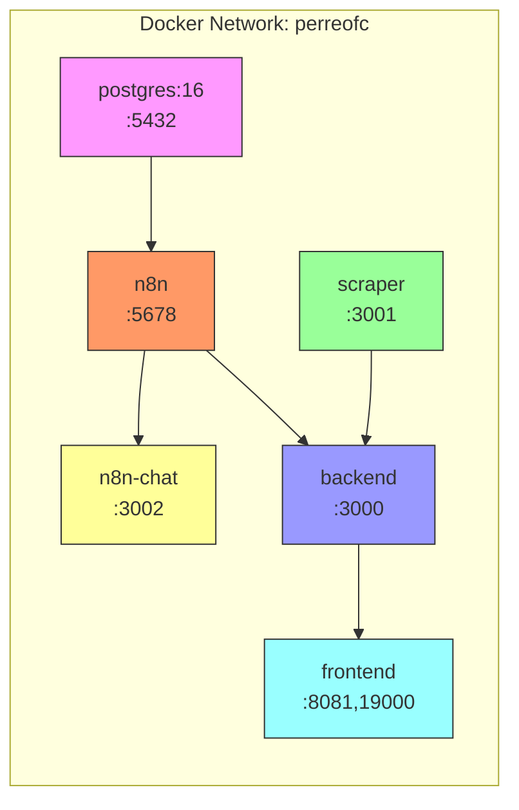

**Servicio `postgres`**

```yaml
image: postgres:16-alpine
environment:
  POSTGRES_USER: ${POSTGRES_USER}
  POSTGRES_PASSWORD: ${POSTGRES_PASSWORD}
  POSTGRES_DB: ${POSTGRES_DB}
healthcheck:
  test: ["CMD-SHELL", "pg_isready -U ${POSTGRES_USER}"]
  interval: 5s
  timeout: 5s
  retries: 5
volumes:
  - ./n8n-local/data/postgres:/var/lib/postgresql/data
```

**Servicio `n8n`**

```yaml
image: docker.n8n.io/n8nio/n8n:latest
ports:
  - "5678:5678"
environment:
  DB_TYPE: postgresdb
  DB_POSTGRESDB_HOST: postgres
  DB_POSTGRESDB_DATABASE: ${POSTGRES_DB}
  DB_POSTGRESDB_USER: ${POSTGRES_USER}
  DB_POSTGRESDB_PASSWORD: ${POSTGRES_PASSWORD}
  N8N_ENCRYPTION_KEY: ${N8N_ENCRYPTION_KEY}
  N8N_BASIC_AUTH_ACTIVE: "true"
  N8N_BASIC_AUTH_USER: ${N8N_BASIC_AUTH_USER}
  N8N_BASIC_AUTH_PASSWORD: ${N8N_BASIC_AUTH_PASSWORD}
  GENERIC_TIMEZONE: ${GENERIC_TIMEZONE}
depends_on:
  postgres:
    condition: service_healthy
volumes:
  - ./n8n-local/data/n8n:/home/node/.n8n
```

**Servicio `scraper`**

```yaml
build:
  context: ./TFG-PERREOFC-SCRAPEO
  dockerfile: Dockerfile.dev
ports:
  - "3001:3001"
environment:
  SUPABASE_URL: ${SUPABASE_URL}
  SUPABASE_SERVICE_KEY: ${SUPABASE_SERVICE_KEY}
  SCRAPER_PORT: ${SCRAPER_PORT}
  INTERNAL_TOKEN: ${INTERNAL_TOKEN}
volumes:
  - ./TFG-PERREOFC-SCRAPEO:/app
  - scraper_node_modules:/app/node_modules
```

**Servicio `backend`**

```yaml
build:
  context: ./perreofc-back
  dockerfile: Dockerfile.dev
ports:
  - "3000:3000"
environment:
  SUPABASE_URL: ${SUPABASE_URL}
  SUPABASE_ANON_KEY: ${SUPABASE_ANON_KEY}
  SUPABASE_SERVICE_KEY: ${SUPABASE_SERVICE_KEY}
  API_PORT: ${API_PORT}
  NODE_ENV: ${NODE_ENV}
  OWN_TEAM_ID: ${OWN_TEAM_ID}
  N8N_WEBHOOK_URL: ${N8N_WEBHOOK_URL}
  GMAIL_USER: ${GMAIL_USER}
  GMAIL_APP_PASSWORD: ${GMAIL_APP_PASSWORD}
  INTERNAL_TOKEN: ${INTERNAL_TOKEN}
depends_on:
  - n8n
  - scraper
volumes:
  - ./perreofc-back:/app
  - backend_node_modules:/app/node_modules
```

**Servicio `frontend`**

```yaml
build:
  context: ./perreofc-front
  dockerfile: Dockerfile.dev
ports:
  - "8081:8081"    # Metro bundler
  - "19000:19000"  # Expo DevTools
  - "19001:19001"  # Expo tunnel
  - "4040:4040"    # ngrok (si se usa)
environment:
  EXPO_PUBLIC_API_URL: http://${LAN_IP}:3000/api/v1
  LAN_IP: ${LAN_IP}
depends_on:
  - backend
volumes:
  - ./perreofc-front:/app
  - frontend_node_modules:/app/node_modules
```

#### 4.8.3 Dockerfiles

**Backend (`perreofc-back/Dockerfile.dev`)**

```dockerfile
FROM node:20-alpine
WORKDIR /app
RUN npm install -g pnpm@9.0.0
COPY package.json pnpm-lock.yaml ./
RUN pnpm install --frozen-lockfile
EXPOSE 3000
CMD ["pnpm", "run", "dev"]
```

El comando `pnpm run dev` usa `tsx watch` que recarga el servidor automáticamente al detectar cambios en `src/`.

**Scraper (`TFG-PERREOFC-SCRAPEO/Dockerfile.dev`)**

```dockerfile
FROM node:20-alpine
# Playwright requiere dependencias del sistema para ejecutar Chromium
RUN apk add --no-cache chromium nss freetype freetype-dev harfbuzz ca-certificates ttf-freefont
ENV PLAYWRIGHT_SKIP_BROWSER_DOWNLOAD=1
ENV CHROMIUM_PATH=/usr/bin/chromium-browser
WORKDIR /app
RUN npm install -g pnpm@9.0.0
COPY package.json pnpm-lock.yaml ./
RUN pnpm install --frozen-lockfile
EXPOSE 3001
CMD ["pnpm", "run", "dev"]
```

Se usa Chromium del sistema (`chromium` de Alpine) en lugar de descargar el binario de Playwright, lo que reduce el tamaño de la imagen.

#### 4.8.4 Gestión de dependencias

El proyecto usa **pnpm** como gestor de paquetes. pnpm crea un almacén global de módulos deduplicado, lo que reduce el espacio en disco y acelera las instalaciones frente a npm.

Los volúmenes Docker nombrados (`backend_node_modules`, `scraper_node_modules`, etc.) evitan que los `node_modules` del host se monten dentro del contenedor, que causaría problemas de compatibilidad entre arquitecturas (e.g., binarios nativos compilados para macOS usados en un contenedor Linux).

#### 4.8.5 Procedimiento de arranque

1. Clonar el repositorio:

```bash
git clone https://github.com/[usuario]/TFG-PERREOFC.git
cd TFG-PERREOFC
```

2. Crear el fichero de variables de entorno:

```bash
cp .env.example .env
# Editar .env con los valores reales
```

3. Aplicar el esquema de base de datos en Supabase Dashboard o mediante la CLI:

```bash
npx supabase db push
```

4. Arrancar todos los servicios:

```bash
docker-compose -f docker-compose.dev.yml up -d
```

5. Verificar que todos los servicios están en ejecución:

```bash
docker-compose -f docker-compose.dev.yml ps
```

6. Verificar la salud del backend:

```bash
curl http://localhost:3000/api/v1/health
```

7. Configurar los workflows de n8n accediendo a `http://localhost:5678` con las credenciales definidas en `.env`.

8. Arrancar la app móvil (en el dispositivo físico o emulador):

```bash
cd perreofc-front
pnpm start
# Escanear el QR con Expo Go, o presionar 'a' para Android / 'i' para iOS
```

#### 4.8.6 Variables de entorno

Ver Anexo A para la lista completa de variables de entorno con su descripción y valores de ejemplo.

---

## 5. Resultados

El proyecto ha dado como resultado un sistema funcional compuesto por cinco servicios integrados. A continuación se detallan los resultados obtenidos por área.

### 5.1 Aplicación móvil

La aplicación móvil está operativa en Android e iOS a través de Expo Go durante el desarrollo. Las funcionalidades implementadas son:

- Registro e inicio de sesión con verificación de correo electrónico.
- Navegación por pestañas con cuatro secciones principales: Calendario, Noticias, Equipo y Chatbot.
- Consulta del calendario mensual con visualización de eventos por día.
- Lectura de noticias y visualización de álbumes de fotos.
- Visualización de la plantilla del equipo con fichas individuales de jugadores.
- Consulta de clasificación de la liga y tabla de goleadores.
- Sistema de Top Fans con ranking en tres períodos (total, mensual, semanal).
- Sistema de apuestas (predicción de resultados) sin dinero real.
- Votación al MVP tras cada partido.
- Chat con el asistente virtual.
- Perfil de usuario con opción de editar datos, cambiar contraseña y eliminar cuenta.
- Panel de administración con gestión de usuarios, configuración de puntos, envío de notificaciones y logs del sistema.
- Soporte de tema claro y oscuro.
- Interfaz en español, catalán e inglés.

### 5.2 API REST

El backend expone más de 60 endpoints distribuidos en 25 módulos funcionales. Todos los endpoints que requieren autenticación están protegidos mediante JWT y el rol del usuario se valida en cada petición. El sistema de *rate limiting* funciona correctamente, rechazando peticiones excesivas con código HTTP 429.

### 5.3 Scraper

El scraper extrae correctamente los datos del equipo propio desde la web de la federación:

- Plantilla completa de jugadores con datos biográficos.
- Cuerpo técnico con sus roles.
- Calendario de partidos de la temporada.
- Clasificación actualizada de la liga.
- Tabla de goleadores.

El sistema de jobs asíncronos permite lanzar scrapers sin bloquear la API y consultar su estado posterior.

### 5.4 Chatbot

El chatbot responde satisfactoriamente preguntas en lenguaje natural sobre el club, incluyendo:

- Información sobre jugadores de la plantilla.
- Resultados y fechas de próximos partidos.
- Posición en la clasificación.
- Estadísticas de goleadores.

La latencia de respuesta varía según el modelo LLM configurado, con tiempos entre 3 y 30 segundos.

### 5.5 Infraestructura

La configuración Docker Compose permite arrancar todos los servicios con un único comando. Los servicios se comunican correctamente a través de la red privada Docker. La persistencia de datos funciona a través de los volúmenes definidos para PostgreSQL y n8n.

---

## 6. Conclusiones

El desarrollo de Perreo FC ha permitido construir un sistema completo de gestión y comunidad para un club de fútbol, integrando tecnologías modernas de forma coherente y funcional.

**Objetivos alcanzados:**

- Se diseñó una arquitectura distribuida de cinco servicios que se comunican de forma desacoplada.
- Se implementó una API REST robusta con autenticación JWT, autorización por roles, rate limiting y auditoría.
- Se desarrolló una aplicación móvil multiplataforma con funcionalidades completas para aficionados, jugadores y administradores.
- Se automatizó la ingesta de datos deportivos mediante un scraper basado en Playwright.
- Se integró un chatbot de inteligencia artificial que usa los datos reales del club.
- Se implementó un sistema de gamificación (puntos, apuestas, ranking) funcional.
- El sistema es seguro: las contraseñas se gestionan con bcrypt a través de Supabase, los tokens tienen TTL cortos, y hay rate limiting en todos los endpoints sensibles.

**Aprendizajes técnicos:**

El proyecto ha supuesto un aprendizaje práctico de varios conceptos avanzados: la gestión de autenticación stateless con JWT en un sistema distribuido, el diseño de una base de datos relacional para un dominio deportivo, la automatización de navegadores web para extracción de datos, la contenedorización de aplicaciones Node.js con Playwright, y la integración de modelos de lenguaje en flujos de trabajo automatizados.

**Limitaciones actuales:**

- El almacén de jobs del scraper es en memoria y no sobrevive reinicios del contenedor.
- No existe una batería de tests automatizados (unitarios ni de integración).
- La app no está publicada en Google Play Store ni App Store (requeriría cuentas de desarrollador de pago).
- El chatbot puede ser lento si se usa un modelo Ollama local en hardware sin GPU.

**Trabajo futuro:**

- Implementar una suite de tests (Jest + supertest para backend, React Native Testing Library para frontend).
- Reemplazar el jobStore en memoria por Redis + Bull para jobs persistentes.
- Publicar la app en las tiendas oficiales usando Expo Application Services (EAS).
- Añadir notificaciones push automáticas cuando termina un partido y se actualizan los resultados.
- Implementar un sistema de amigos/seguidores entre aficionados.
- Añadir estadísticas avanzadas por jugador (mapas de calor, progresos por temporada).

En resumen, Perreo FC demuestra que es posible construir, en el contexto de un proyecto final de ciclo, un sistema de software real, completo y con una arquitectura profesional. El conjunto de tecnologías elegido —Fastify, React Native/Expo, Supabase, Playwright, n8n y Docker— representa el estado del arte en el desarrollo de aplicaciones web y móviles modernas.

---

## 7. Referencias Bibliográficas

Las referencias siguen las normas Vancouver:

1. Fastify Team. Fastify Documentation [Internet]. Fastify; 2024 [citado 2026 jun]. Disponible en: https://fastify.dev/docs/latest/

2. Expo Team. Expo Documentation [Internet]. Expo; 2024 [citado 2026 jun]. Disponible en: https://docs.expo.dev/

3. Supabase Team. Supabase Documentation [Internet]. Supabase Inc.; 2024 [citado 2026 jun]. Disponible en: https://supabase.com/docs

4. Microsoft Corporation. Playwright Documentation [Internet]. Microsoft; 2024 [citado 2026 jun]. Disponible en: https://playwright.dev/docs/intro

5. n8n GmbH. n8n Documentation [Internet]. n8n; 2024 [citado 2026 jun]. Disponible en: https://docs.n8n.io/

6. Colber T. TypeScript Handbook [Internet]. Microsoft; 2024 [citado 2026 jun]. Disponible en: https://www.typescriptlang.org/docs/handbook/

7. Docker Inc. Docker Documentation [Internet]. Docker; 2024 [citado 2026 jun]. Disponible en: https://docs.docker.com/

8. The PostgreSQL Global Development Group. PostgreSQL 16 Documentation [Internet]. PostgreSQL; 2024 [citado 2026 jun]. Disponible en: https://www.postgresql.org/docs/16/

9. Kolodny E, Zustand team. Zustand Documentation [Internet]. pmndrs; 2024 [citado 2026 jun]. Disponible en: https://docs.pmnd.rs/zustand/

10. Katz Y, Camba R. React Hook Form Documentation [Internet]; 2024 [citado 2026 jun]. Disponible en: https://react-hook-form.com/

11. Colchero F, NativeWind team. NativeWind Documentation [Internet]; 2024 [citado 2026 jun]. Disponible en: https://www.nativewind.dev/

12. Leijen D, pnpm contributors. pnpm Documentation [Internet]; 2024 [citado 2026 jun]. Disponible en: https://pnpm.io/

13. OpenJS Foundation. Node.js Documentation [Internet]. OpenJS Foundation; 2024 [citado 2026 jun]. Disponible en: https://nodejs.org/docs/latest/api/

14. Brocco F, Zod contributors. Zod Documentation [Internet]; 2024 [citado 2026 jun]. Disponible en: https://zod.dev/

15. Real Federación de Fútbol de Madrid. Portal oficial de la RFFM [Internet]. RFFM; 2024 [citado 2026 jun]. Disponible en: https://www.rffm.es/

---

## 8. Anexos

### Anexo A: Variables de entorno

Lista completa de variables de entorno necesarias para el sistema. Los valores mostrados son de ejemplo y deben reemplazarse por credenciales reales en producción.

| Variable | Servicio | Descripción | Ejemplo |
|---|---|---|---|
| `SUPABASE_URL` | Backend, Scraper | URL del proyecto Supabase | `https://abc.supabase.co` |
| `SUPABASE_ANON_KEY` | Backend | Clave pública de Supabase (JWT anónimo) | `eyJhbGciOi...` |
| `SUPABASE_SERVICE_KEY` | Backend, Scraper | Clave de servicio de Supabase (acceso total) | `eyJhbGciOi...` |
| `API_PORT` | Backend | Puerto de escucha del backend | `3000` |
| `NODE_ENV` | Backend | Entorno de ejecución | `development` |
| `OWN_TEAM_ID` | Backend | ID del equipo propio en la federación | `24141910` |
| `GMAIL_USER` | Backend | Correo Gmail para envíos de sistema | `perreofc26@gmail.com` |
| `GMAIL_APP_PASSWORD` | Backend | Contraseña de aplicación de Google | `xxxx xxxx xxxx xxxx` |
| `N8N_WEBHOOK_URL` | Backend | URL del webhook del chatbot en n8n | `http://n8n:5678/webhook/perreito-chatbot` |
| `INTERNAL_TOKEN` | Backend, Scraper | Token secreto para comunicación interna | `a0a439f88...` |
| `FRONTEND_URL` | Backend | URL del frontend (CORS en producción) | `https://app.perreofc.es` |
| `SCRAPER_PORT` | Scraper | Puerto de escucha del scraper | `3001` |
| `POSTGRES_USER` | PostgreSQL, n8n | Usuario de la base de datos de n8n | `n8n` |
| `POSTGRES_PASSWORD` | PostgreSQL, n8n | Contraseña de la base de datos de n8n | `secreta123` |
| `POSTGRES_DB` | PostgreSQL, n8n | Nombre de la base de datos de n8n | `n8n` |
| `N8N_ENCRYPTION_KEY` | n8n | Clave de cifrado para credenciales de n8n | `wX0DNTzH...` |
| `N8N_BASIC_AUTH_USER` | n8n | Usuario del panel de administración de n8n | `admin` |
| `N8N_BASIC_AUTH_PASSWORD` | n8n | Contraseña del panel de n8n | `Perreofc@2026` |
| `N8N_PORT` | n8n | Puerto del motor n8n | `5678` |
| `GENERIC_TIMEZONE` | n8n | Zona horaria para ejecutar workflows | `Europe/Madrid` |
| `CHAT_PORT` | Chat Bridge | Puerto del servidor Chat Bridge | `3002` |
| `N8N_CHAT_WEBHOOK_URL` | Chat Bridge | URL del webhook del chatbot | `http://n8n:5678/webhook/perreito-chatbot` |
| `EXPO_PUBLIC_API_URL` | Frontend | URL base de la API accesible desde la app | `http://192.168.1.29:3000/api/v1` |
| `LAN_IP` | Frontend | IP de la máquina host en la red local | `192.168.1.29` |

---

### Anexo B: Esquema completo de la base de datos

A continuación se presentan las sentencias SQL de creación de las tablas principales.

```sql
-- Enumeraciones
CREATE TYPE user_role AS ENUM ('aficionado', 'jugador', 'admin', 'superadmin');
CREATE TYPE visibility_role AS ENUM ('aficionado', 'jugador', 'admin', 'superadmin');
CREATE TYPE match_status AS ENUM ('upcoming', 'live', 'finished');
CREATE TYPE form_result AS ENUM ('win', 'draw', 'loss');
CREATE TYPE chat_sender AS ENUM ('user', 'bot');
CREATE TYPE competition_type AS ENUM ('league', 'cup', 'friendly');

-- Tabla de usuarios
CREATE TABLE users (
  id UUID PRIMARY KEY REFERENCES auth.users(id) ON DELETE CASCADE,
  email TEXT UNIQUE NOT NULL,
  username TEXT UNIQUE NOT NULL,
  first_name TEXT NOT NULL,
  last_name TEXT NOT NULL,
  avatar_url TEXT,
  role user_role NOT NULL DEFAULT 'aficionado',
  points INTEGER NOT NULL DEFAULT 0,
  banned BOOLEAN NOT NULL DEFAULT FALSE,
  player_id INTEGER REFERENCES players(id) ON DELETE SET NULL,
  created_at TIMESTAMPTZ NOT NULL DEFAULT NOW()
);

-- Tabla de equipos
CREATE TABLE teams (
  id INTEGER PRIMARY KEY,
  name TEXT NOT NULL,
  category TEXT,
  home_day TEXT,
  home_schedule TEXT,
  created_at TIMESTAMPTZ NOT NULL DEFAULT NOW(),
  updated_at TIMESTAMPTZ,
  scraped_at TIMESTAMPTZ
);

-- Tabla de jugadores
CREATE TABLE players (
  id INTEGER PRIMARY KEY,
  full_name TEXT NOT NULL,
  first_name TEXT,
  last_name TEXT,
  birth_year INTEGER,
  position_code TEXT,
  is_goalkeeper BOOLEAN NOT NULL DEFAULT FALSE,
  photo_url TEXT,
  team_id INTEGER REFERENCES teams(id) ON DELETE SET NULL
);

-- Tabla de partidos
CREATE TABLE matches (
  id INTEGER PRIMARY KEY,
  home_team_id INTEGER NOT NULL REFERENCES teams(id),
  away_team_id INTEGER NOT NULL REFERENCES teams(id),
  date DATE,
  time TIME,
  location TEXT,
  goals_home INTEGER,
  goals_away INTEGER,
  status match_status NOT NULL DEFAULT 'upcoming',
  group_id INTEGER REFERENCES competition_groups(id),
  competition_id INTEGER REFERENCES competitions(id),
  round_number INTEGER,
  match_minute INTEGER,
  spectators INTEGER,
  referee TEXT
);

-- Tabla de apuestas
CREATE TABLE bets (
  id UUID PRIMARY KEY DEFAULT gen_random_uuid(),
  user_id UUID NOT NULL REFERENCES users(id) ON DELETE CASCADE,
  match_id INTEGER NOT NULL REFERENCES matches(id) ON DELETE CASCADE,
  prediction TEXT NOT NULL CHECK (prediction IN ('home_win', 'draw', 'away_win')),
  points_wagered INTEGER NOT NULL DEFAULT 0,
  result TEXT NOT NULL DEFAULT 'pending' CHECK (result IN ('won', 'lost', 'pending')),
  settled_at TIMESTAMPTZ,
  created_at TIMESTAMPTZ NOT NULL DEFAULT NOW(),
  UNIQUE (user_id, match_id)
);

-- Tabla de transacciones de puntos
CREATE TABLE points_transactions (
  id UUID PRIMARY KEY DEFAULT gen_random_uuid(),
  user_id UUID NOT NULL REFERENCES users(id) ON DELETE CASCADE,
  amount INTEGER NOT NULL,
  action TEXT NOT NULL,
  related_id TEXT,
  created_at TIMESTAMPTZ NOT NULL DEFAULT NOW()
);

-- Tabla de votos MVP
CREATE TABLE mvp_votes (
  id UUID PRIMARY KEY DEFAULT gen_random_uuid(),
  user_id UUID NOT NULL REFERENCES users(id) ON DELETE CASCADE,
  match_id INTEGER NOT NULL REFERENCES matches(id) ON DELETE CASCADE,
  player_id INTEGER NOT NULL REFERENCES players(id) ON DELETE CASCADE,
  created_at TIMESTAMPTZ NOT NULL DEFAULT NOW(),
  UNIQUE (user_id, match_id)
);

-- Tabla de logs del sistema
CREATE TABLE system_logs (
  id UUID PRIMARY KEY DEFAULT gen_random_uuid(),
  admin_id UUID NOT NULL REFERENCES users(id),
  action TEXT NOT NULL,
  resource_type TEXT NOT NULL,
  resource_id TEXT,
  changes JSONB,
  ip_address TEXT,
  created_at TIMESTAMPTZ NOT NULL DEFAULT NOW()
);

-- Índices
CREATE UNIQUE INDEX idx_users_email ON users(email);
CREATE UNIQUE INDEX idx_users_username ON users(username);
CREATE UNIQUE INDEX idx_bets_user_match ON bets(user_id, match_id);
CREATE UNIQUE INDEX idx_mvp_user_match ON mvp_votes(user_id, match_id);
CREATE INDEX idx_points_transactions_user ON points_transactions(user_id);
CREATE INDEX idx_points_transactions_created ON points_transactions(created_at);
CREATE INDEX idx_matches_date ON matches(date);
CREATE INDEX idx_matches_status ON matches(status);
CREATE INDEX idx_system_logs_admin ON system_logs(admin_id);
CREATE INDEX idx_system_logs_created ON system_logs(created_at);
```

---

### Anexo C: Referencia completa de la API

Todos los endpoints están bajo el prefijo `/api/v1`. Los que requieren autenticación lo indican con `[Auth]`. Los que requieren un rol específico lo indican con `[Role: X]`.

#### Autenticación

| Método | Ruta | Descripción | Notas |
|---|---|---|---|
| `POST` | `/auth/register` | Crear cuenta | Rate: 5/min |
| `POST` | `/auth/login` | Iniciar sesión | Rate: 10/min |
| `POST` | `/auth/logout` | Cerrar sesión | [Auth] |
| `POST` | `/auth/refresh` | Renovar token | |
| `POST` | `/auth/forgot-password` | Solicitar recuperación | Rate: 3/h |
| `POST` | `/auth/reset-password` | Restablecer contraseña | |
| `POST` | `/auth/reset-password-otp` | Restablecer con OTP | |
| `POST` | `/auth/verify-otp` | Verificar OTP | |
| `POST` | `/auth/verify-password` | Verificar contraseña actual | [Auth] |
| `POST` | `/auth/change-password` | Cambiar contraseña | [Auth] Rate: 3/24h |
| `GET` | `/auth/change-password/status` | Límite de cambios | [Auth] |

#### Usuarios y perfil

| Método | Ruta | Descripción |
|---|---|---|
| `GET` | `/me` | Perfil propio |
| `GET` | `/me/profile` | Perfil extendido |
| `PUT` | `/me/profile` | Actualizar perfil |
| `GET` | `/users?search=&page=&limit=` | Listar usuarios [Role: admin] |
| `GET` | `/admin/users/:id` | Ver usuario [Role: admin] |
| `POST` | `/admin/users` | Crear usuario [Role: admin] |
| `PUT` | `/admin/users/:id` | Editar usuario [Role: admin] |
| `DELETE` | `/admin/users/:id` | Eliminar usuario [Role: admin] |
| `POST` | `/admin/users/:id/ban` | Banear/desbanear [Role: admin] |
| `POST` | `/admin/users/:id/points` | Ajustar puntos [Role: admin] |
| `POST` | `/users/request-delete-account` | Solicitar baja |
| `POST` | `/users/confirm-delete-account` | Confirmar baja con PIN |
| `GET` | `/users/unlinked-players` | Jugadores sin cuenta |

#### Equipos y jugadores

| Método | Ruta | Descripción |
|---|---|---|
| `GET` | `/teams/:teamId` | Info del equipo |
| `GET` | `/teams/:teamId/squad` | Plantilla y staff |
| `GET` | `/teams/:teamId/matches` | Partidos del equipo |
| `GET` | `/teams/:teamId/statistics` | Estadísticas |
| `GET` | `/players/:playerId` | Ficha de jugador |
| `POST` | `/admin/players` | Crear jugador [Role: admin] |
| `PUT` | `/admin/players/:playerId` | Editar jugador [Role: admin] |

#### Competición y datos deportivos

| Método | Ruta | Descripción |
|---|---|---|
| `GET` | `/competitions?seasonId=` | Listar competiciones |
| `GET` | `/seasons` | Listar temporadas |
| `GET` | `/seasons/:seasonId` | Detalle de temporada |
| `GET` | `/groups/:groupId/matches` | Partidos de un grupo |
| `GET` | `/matches/:matchId` | Detalle de partido |
| `POST` | `/admin/matches` | Crear partido [Role: admin] |
| `GET` | `/classification?groupId=&seasonId=` | Clasificación de liga |
| `GET` | `/top-scorers?competitionId=` | Tabla de goleadores |

#### Engagement

| Método | Ruta | Descripción |
|---|---|---|
| `POST` | `/bets` | Hacer apuesta [Auth] |
| `GET` | `/bets?status=&page=&limit=` | Mis apuestas [Auth] |
| `POST` | `/admin/bets/settle` | Resolver apuestas [Role: admin] |
| `POST` | `/mvp-votes` | Votar MVP [Auth] |
| `GET` | `/mvp-votes/:matchId` | Ver votos de un partido |
| `GET` | `/leaderboard?period=&page=&limit=` | Ranking Top Fans |
| `GET` | `/points/config` | Configuración de puntos |
| `POST` | `/admin/points/config` | Editar puntos [Role: superadmin] |
| `GET` | `/points/transactions` | Mis transacciones [Auth] |

#### Contenido

| Método | Ruta | Descripción |
|---|---|---|
| `GET` | `/news?page=&limit=` | Listar noticias |
| `GET` | `/news/:newsId` | Leer noticia |
| `POST` | `/news` | Crear noticia [Auth] |
| `PUT` | `/news/:newsId` | Editar noticia [Auth] |
| `DELETE` | `/news/:newsId` | Eliminar noticia [Auth] |
| `GET` | `/events?page=&limit=` | Listar eventos |
| `GET` | `/events/:eventId` | Ver evento |
| `POST` | `/events` | Crear evento [Auth] |
| `PUT` | `/events/:eventId` | Editar evento [Auth] |
| `DELETE` | `/events/:eventId` | Eliminar evento (soft delete) [Auth] |
| `GET` | `/albums?page=&limit=` | Listar álbumes |
| `GET` | `/albums/:albumId` | Ver álbum con fotos |
| `POST` | `/albums` | Crear álbum [Auth] |
| `PUT` | `/albums/:albumId` | Editar álbum [Auth] |
| `DELETE` | `/albums/:albumId` | Eliminar álbum [Auth] |
| `POST` | `/albums/:albumId/photos` | Añadir foto [Auth] |
| `PUT` | `/albums/:albumId/photos/:photoId` | Editar foto [Auth] |
| `DELETE` | `/albums/:albumId/photos/:photoId` | Eliminar foto [Auth] |
| `POST` | `/upload` | Subir archivo [Auth] |

#### Chat y notificaciones

| Método | Ruta | Descripción |
|---|---|---|
| `POST` | `/chat/sessions` | Crear sesión de chat [Auth] |
| `POST` | `/chat/:sessionId/messages` | Enviar mensaje [Auth] |
| `GET` | `/chat/:sessionId/messages` | Historial de chat [Auth] |
| `GET` | `/notifications?page=&limit=` | Mis notificaciones [Auth] |
| `PUT` | `/notifications/:notificationId` | Marcar como leída [Auth] |

#### Administración

| Método | Ruta | Descripción |
|---|---|---|
| `GET` | `/squad-calls/:matchId` | Ver convocatoria [Auth] |
| `PUT` | `/squad-calls/:callId` | Actualizar convocatoria [Role: admin] |
| `GET` | `/admin/logs?action=&resource=&page=` | Logs del sistema [Role: admin] |
| `GET` | `/home/quick-classification` | Clasificación para home |
| `GET` | `/home/recent-matches` | Últimos partidos |
| `GET` | `/home/upcoming-matches` | Próximos partidos |
| `GET` | `/health` | Estado del servidor |

---

### Anexo D: Glosario

| Término | Definición |
|---|---|
| **API REST** | Interfaz de programación de aplicaciones que sigue los principios REST (Representational State Transfer), comunicándose mediante HTTP y JSON. |
| **JWT** | JSON Web Token. Estándar para la transmisión segura de información entre partes como un objeto JSON firmado digitalmente. |
| **Scraper** | Programa que extrae datos automáticamente de páginas web mediante simulación de un navegador. |
| **Headless browser** | Navegador web que opera sin interfaz gráfica, usado en automatización y scraping. |
| **Upsert** | Operación de base de datos que inserta un registro si no existe, o lo actualiza si ya existe. |
| **Hot reload** | Recarga automática de la aplicación al detectar cambios en el código fuente, sin perder el estado actual. |
| **Monorepo** | Repositorio único que contiene varios proyectos o servicios relacionados. |
| **Docker Compose** | Herramienta para definir y gestionar aplicaciones Docker con múltiples contenedores. |
| **Soft delete** | Técnica de "borrado lógico" que marca un registro como eliminado sin borrarlo físicamente de la base de datos. |
| **Rate limiting** | Limitación del número de peticiones que un cliente puede hacer en un período de tiempo. |
| **OTP** | One-Time Password. Contraseña de un único uso, válida por un período corto de tiempo. |
| **LLM** | Large Language Model. Modelo de inteligencia artificial entrenado con grandes cantidades de texto, capaz de generar y comprender lenguaje natural. |
| **n8n** | Plataforma de automatización de flujos de trabajo de código abierto, similar a Zapier pero auto-hospedable. |
| **Supabase** | Plataforma Backend-as-a-Service de código abierto basada en PostgreSQL que ofrece autenticación, base de datos y almacenamiento. |
| **Expo** | Plataforma y SDK para desarrollar aplicaciones React Native con herramientas adicionales de compilación y despliegue. |
| **Fastify** | Framework de servidor HTTP para Node.js con énfasis en el rendimiento y el tipado. |
| **Playwright** | Framework de Microsoft para automatización y pruebas de navegadores web. |
| **Zustand** | Librería minimalista de gestión de estado global para React. |
| **NativeWind** | Implementación de Tailwind CSS para React Native. |
| **pnpm** | Gestor de paquetes Node.js eficiente que usa enlaces simbólicos para deduplicar módulos. |
| **FCM** | Firebase Cloud Messaging. Servicio de Google para enviar notificaciones push a dispositivos iOS y Android. |
| **RFFM** | Real Federación de Fútbol de Madrid. Organismo que gestiona el fútbol amateur en la Comunidad de Madrid. |
| **MVP** | Most Valuable Player. Jugador más valioso de un partido, elegido por votación de los aficionados. |
| **Top Fans** | Sistema de ranking de aficionados basado en puntos acumulados por participación en la app. |
| **Enum** | Tipo de dato que acepta un conjunto predefinido de valores. En PostgreSQL, se declaran explícitamente con `CREATE TYPE ... AS ENUM`. |
| **Middleware** | Función que se ejecuta antes o después del manejador principal de una ruta HTTP. |
| **Prehandler** | Término de Fastify para el middleware que se ejecuta antes del manejador de ruta. |
| **Webhook** | Mecanismo por el que un servidor envía notificaciones HTTP a otro servidor cuando ocurre un evento. |
| **CORS** | Cross-Origin Resource Sharing. Mecanismo de seguridad que controla qué dominios pueden hacer peticiones a una API desde un navegador. |
